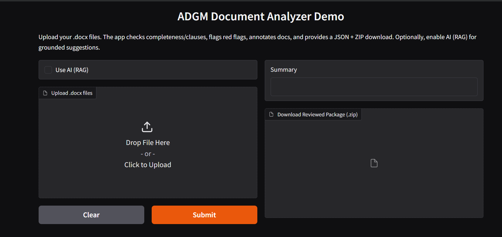
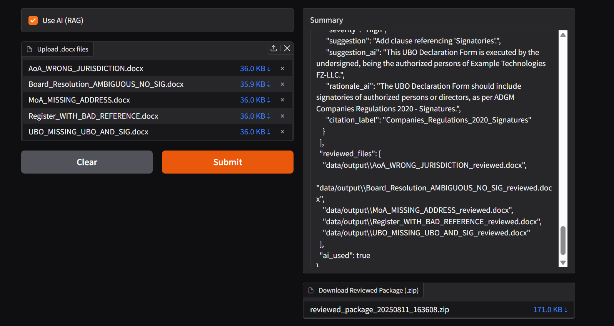
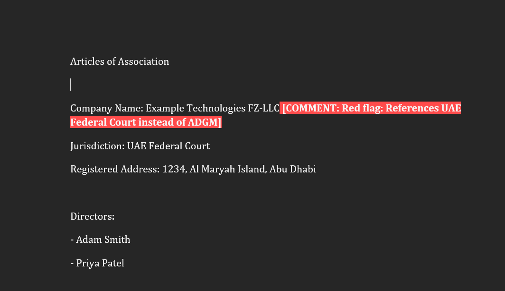

# ADGM Corporate Agent – Document Intelligence (RAG + Inline Review)

An AI-powered legal assistant that reviews ADGM incorporation documents, checks completeness against a required checklist, flags red flags, inserts contextual inline comments with citations, and outputs both reviewed .docx files and a structured JSON report. Built with Gradio UI and Groq’s OpenAI-compatible API using your OPENAI_API_KEY.

- Inputs: .docx files
- Outputs:
  - Reviewed .docx files with highlights and inline comments
  - Structured JSON summary (process, missing docs, issues, AI rationale/suggestions)
- RAG: Uses curated ADGM snippets (data/adgm_refs.txt) to ground AI suggestions

---

## Demo Screenshots

- UI Home (Upload + Use AI toggle)
  - 

- Results view (Summary + Download ZIP)
  - 

- Example reviewed document (comments showing “AI Suggestion: … | Source: …”)
  - 

---

## Features

- Accepts multiple .docx files
- Infers document type from filename and, if needed, from content
- Detects target legal process (Company Incorporation) and checks required document completeness
- Flags red flags:
  - Incorrect jurisdiction (e.g., UAE Federal Courts instead of ADGM)
  - Missing signatory sections
  - Ambiguous or non-binding language
- Adds inline comments to .docx with color highlights and citation labels
- RAG-grounded AI suggestions via Groq endpoint, with rationale and concise compliant clauses
- Produces a JSON summary including all issues and AI fields

---

## Tech Stack

- Python 3.10+
- Gradio
- python-docx
- Groq (OpenAI-compatible API)
- python-dotenv

---

## Setup

1) Clone the repo
git clone https://github.com/2CentsCapitalHR/ai-engineer-task-MohitWarrier.git

cd ai-engineer-task-MohitWarrier

2) Create and activate a virtual environment
python -m venv .venv
Windows (PowerShell)
. .venv/Scripts/Activate.ps1

3) Install dependencies
pip install -r requirements.txt

4) Environment variable
- Create a .env file in the project root:
OPENAI_API_KEY=gsk_your_groq_key_here
Note: We intentionally use the variable name OPENAI_API_KEY, but route to Groq’s OpenAI-compatible endpoint.

5) RAG references
- Ensure data/adgm_refs.txt exists. This file contains curated snippets from official ADGM sources, with labels such as:
[Companies Regulations 2020 - Jurisdiction]
...your snippet text...

Add as many labeled sections as needed. Labels will appear in reviewed comments as “Source: [Label]”.

---

## Run
python main.py

- Open the local URL shown by Gradio (e.g., http://127.0.0.1:7860).
- Tick “Use AI (RAG)” to enable AI-grounded suggestions.
- Upload .docx files.
- Download the reviewed ZIP and inspect the JSON summary.

---

## Troubleshooting

- AI not active
  - Ensure .env exists at project root with OPENAI_API_KEY=gsk_...
  - Re-run python main.py from the project root (so load_dotenv finds .env)
  - Confirm console shows OPENAI_API_KEY present: True
- No AI suggestions
  - Ensure data/adgm_refs.txt exists and has content
  - Ensure “Use AI (RAG)” checkbox is ON
- Duplicate comments
  - The app de-duplicates identical text per paragraph, but similar suggestions with slightly different text may still both appear.

---